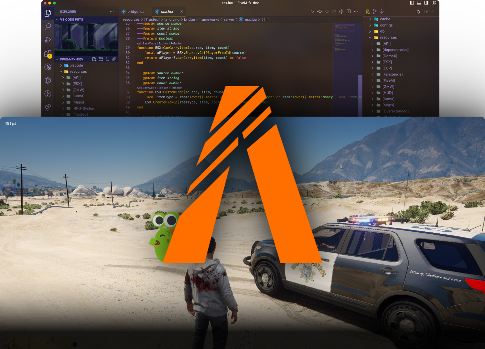

import { Callout } from 'nextra/components';

# FiveM Information

<Callout type="info">
    More in-depth guides about various FiveM topics will be added over time.
</Callout>

## FiveM Blips

All information about FiveM blips can be found on the following page: [FiveM Blips](https://docs.fivem.net/docs/game-references/blips/)

## FiveM Peds

All information about FiveM Peds can be found on the following page: [FiveM Peds](https://docs.fivem.net/docs/game-references/ped-models/)