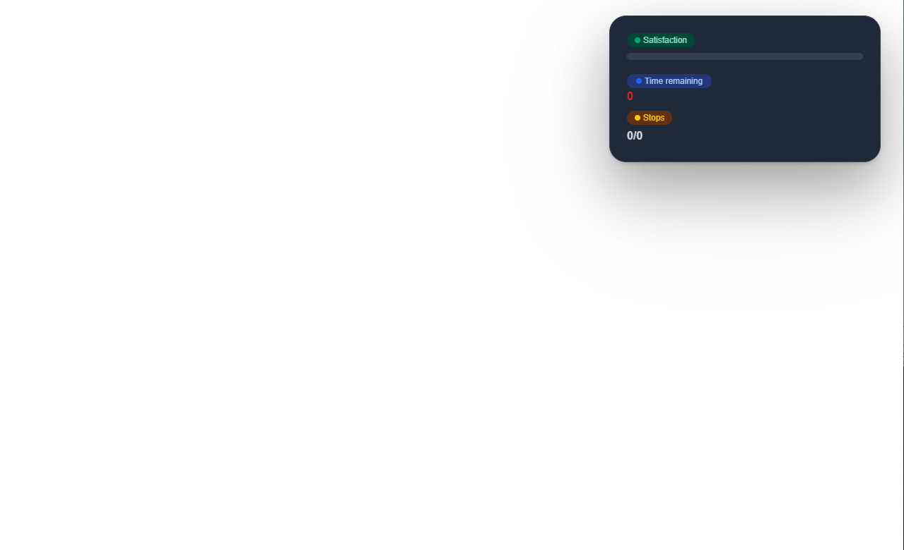

import { Callout } from 'nextra/components';
import { Tabs, Tab} from 'nextra-theme-docs';

# Configurations

During the creation of this script we've made sure that every important aspect is configurable to ensure that you can change the script to your needs.

## Framework
As the script is using a bridge to enable compatibility with every framework you need to make sure that your framework is named here.

```lua
Config.Framework = "ESX"
```

- Framework: `string`

## Duty Start
Define the location at wich a player can go on/off duty.

```lua copy
Config.DutyStart = {
    {coords = vec3(452.77, -621.58, 28.56), label = 'Bus Station Downtown LS'},
    {coords = vec3(1718.59, 4792.07, 41.98), label = 'Bus Station Blaine County', blip = {
        id = 85,
        scale = 0.8,
        color = -1
    }},
}
```

- DutyStart: `table`
    - coords: `vec3` (the position of the bus station)
    - label: `string` (the name of the bus station)
    - blip?: `table` (blip customization)
        - id: `string`
        - scale: `number`
        - color: `number`

## Live Blip / Radar
Enable / disable the usage of a blip that acts as a live radar for players to see the location of a bus line. This blip isn't fully accurate and is only update every few seconds (or what you configured it to be).

```lua copy
Config.LiveBlip = true
```

- LiveBlip: `boolean`

## Live Blip / Radar Interval
Choose the interval for every update of the live radar. 

```lua copy
Config.LiveBlipInterval = 1e4 --> 10000
```

- LiveBlipInterval: `number`

## Need Job
Does the player need a job to be able to start bus lines.

```lua copy
Config.NeedJob = true
```

- NeedJob: `boolean`

## Start Location
Set the starting location of a bus line.

```lua copy
Config.Start = {
    ['X49'] = {coords = vec4(459.03, -633.20, 28.49, 220.00), bus_model = "bus", extra = 1, time = 7},
    ['071'] = {coords = vec4(1711.28, 4806.75, 41.81, 101.42), bus_model = "bus", extra = 1, time = 20},
}
```

- Start: `table`
    - Name of the bus line (Key): `table` 
        - coords: `vec4` (the location)
        - bus_model: `string` (the model of the bus used by the player)
        - trailer_model?: `string` (if you want to use a bus with a trailer)
        - extra: `number` (wich extra the bus should have)
        - livery?: `number` (wich livery the bus should have)
        - time: `number` (the amount of time in minutes to finish the line)

    *example:*
    <Tabs items={["Standard", "With trailer"]}>
        <Tab>
            ```lua copy
            ['X49'] = {coords = vec4(459.03, -633.20, 28.49, 220.00), bus_model = "bus", extra = 1, time = 7},
            ```
        </Tab>
        <Tab>
            ```lua copy
            ['SB82'] = {coords = vec4(459.03, -633.20, 28.49, 220.00), bus_model = "bus", trailer_model = "bustrailermodel", extra = 1, livery = 3, time = 12},
            ```
        </Tab>
    </Tabs>

## Salary
Set the salary wich is binded to a bus line.

```lua copy
Config.Salary = {
    ["X49"] = 1200,
    ["071"] = 8000,
    ...
}
```

- Salary: `table`
    - Name of the bus line (Key): `number`

    <Callout type="warning">
        Please make sure that the key is matching the other keys! Otherwise the script will not bind the data!
    </Callout>

## Routes
Set the bus station of a bus line.

<Callout type="warning">
    The last stop is the end of the line. This means that if your last stop is in the middle of nowhere the player will be stuck there with no vehicle!
</Callout>

```lua copy
Config.Routes = {
    ["X49"] = {
        {bus_stop = "Strawberry Ave -> LSIA", coords = vec4(307.61, -766.03, 29.25, 162.15)},
        {bus_stop = "LSIA -> Downtown LS", coords = vec4(-1032.13, -2730.21, 20.12, 245.97)},
        {bus_stop = "Downtown LS", coords = vec4(457.85, -638.85, 28.50, 35.69)},
    },
    ["071"] = {
        {bus_stop = "Grapeseed Main Street -> Paleto Bay", coords = vec4(1829.96, 5066.94, 58.22, 305.90)},
        {bus_stop = "Paleto Bay -> Grapeseed", coords = vec4(-312.54, 6043.30, 32.23, 313.72)},
        {bus_stop = "Grapeseed", coords = vec4(1708.73, 4806.32, 42.64, 271.34)},
    },
    ...
}
```

- Routes: `table`
    - Name of the bus line (Key): `table`: 
        - bus_stop: `string` (name of the bus stop)
        - coords: `vec4` (location of the bus stop)
        - changeExtra?: `number` (changes the bus extra at this specific stop) 
    
    *example:*
    ```lua copy
    ["071"] = {
        {bus_stop = "Strawberry Ave -> LSIA", coords = vec4(307.61, -766.03, 29.25, 162.15), changeExtra = 2},
    }
    ```

    <Callout type="warning">
        Please make sure that the key is matching the other keys! Otherwise the script will not bind the data!
    </Callout>

## Uniform
If this configuration is enabled the player will be given a uniform upon starting his duty.

```lua copy 
Config.Uniform = {
    Enabled = true,
    Male = {
        arms = 11,
        pants_1 = 13, pants_2 = 0,
        shoes_1 = 51, shoes_2 = 0,
        tshirt_1 = 15, tshirt_2 = 0,
        bproof_1 = 52,
        torso_1 = 213, torso_2 = 10,
    },
    Female = {
        ...
    }
}
```

- Uniform: `table`
    - Enabled: `boolean` (determines the player will wear a uniform or not)
    - Male: `table` (contains clothing data)
    - Female: `table` (contains clothing data)

<Callout type="warning">
    Please keep in mind that this function has only been tested with ESX!
</Callout>

## NPCs
As the script utilizes NPC interactions you can add peds to this list, so that they can be spawned in a randomized order while the player is driving an active bus line.
<Callout type="info">
    We highly advice you to use scenario peds, as these have different apperarences every time they spawn. This ensures an immersive experience for the player. 
</Callout>

```lua copy 
Config.NPC = {
    "s_m_m_autoshop_01",
    "s_m_m_dockwork_01",
    "s_m_m_hairdress_01",
    ...
}
```

- NPC: `table<string>`

## UI Custimization
If you want to customize the provided UI you can use the following options.

```lua copy
Config.UI = {
    Text = {
        time_remaining = "Verbleibende Zeit",
        stops = "Haltestelle",
        satisfaction = "Zufriedenheit der Gäste"
    },
    Position = {
        marginRight = 0,
        marginTop = 0,
    }
}
```

- Text: `table`
    - time_remaining: `string`
    - stops: `string`
    - satisfaction: `string`

<Callout type="info">
    The default values are mt-[1.5rem] and mr-[2rem]. Any changes to the following options will overwrite these vaules in rem. So if you want your right padding to be 10 the value will be overwritten to mr-[10rem].
</Callout>
- Position: `table`
    - marginRight: `number`
    - marginTop: `number`

### Additional Infomation:

As mentioned before the default vaules are used if your options are equal to 0. By default the UI is in the to right of your screen with some spacing.



If you wanted the UI to be in the bottom right and a bit further from the right border you'd have to write the following config options: 
```lua copy
Position = {
    marginRight = 10,
    marginTop = 34,
}
```


This means that the greater the number you choose the further the UI will move to the bottom/left of your screen.